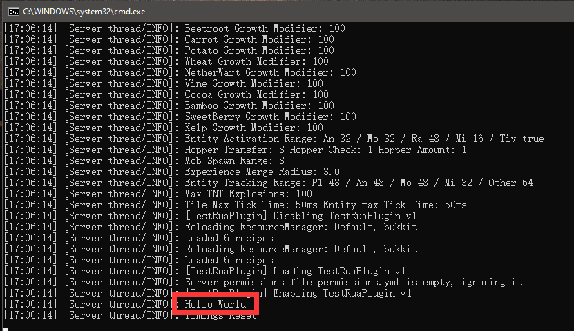

# 最简单的插件

# Bukkit插件的本质
插件本质是一个基于BukkitAPI的Java应用. 一个插件必须要有 主类 和 `plugin.yml`文件.

例如下面是一个常见插件, 让我们找一下它的主类和`plugin.yml`文件.  


# 简单的插件
在编写自己想做的插件之前, 不妨做一个简单的插件来了解一下Bukkit插件如何编写.    

新建一个Java工程, 导入开服用的服务端jar文件到工程的Libraries中. 创建`tdiant.helloworld.HelloWorld`类作为插件的主类, 并继承`JavaPlugin`类.  
在主类里覆写`onEnable`方法和`onDisable`方法. 完成后, 代码应该类似这样:  

```java
package tdiant.helloworld;  
  
import org.bukkit.plugin.java.JavaPlugin;  
  
public class HelloWorld extends JavaPlugin {
    @Override  
    public void onEnable(){  
        System.out.println("Hello World");
    }  
  
    @Override      
    public void onDisable(){  
        
    }  
}  
```

Bukkit服务端会在插件被启用时调用`onEnable`方法, 被停用时调用`onDisable`方法.

创建`plugin.yml`文件. 打开plugin.yml文件并在其中输入如下信息：  
```yml
name: HelloWorld
main: tdiant.helloworld.HelloWorld
version: 1
author: tdiant
```

> **特别注意: 如果你的插件是基于新版本API(1.13以及以上版本)编写的, 应当在plugin.yml中额外增加`api-version: 1.13`键值对.例如这样:**  
> ```yml
> name: HelloWorld
> main: tdiant.helloworld.HelloWorld
> api-version: 1.13
> version: 1
> author: BakaRinya
> ```
> **这会告诉Bukkit, 这个插件是基于新版API编写的.**  
> 若要兼容1.13及以上版本的同时兼容旧版本, 应特别注意各版本之间的 API 变化(譬如1.12进度系统取代了成就系统, 1.13的 Material 枚举发生了巨大变化).

*注意: 主类的名称并不是固定的, 但是`plugin.yml`文件的名称是固定的.*     

上面的plugin.yml文件逐行分析如下：

| 键 | 意义 | 备注 |
| :-:   | :-:   | :- |
| name | 插件名 | 不允许带有中文和空格, 推荐只含有下划线、英文. |  
| main | 插件的完整主类名 | 例如我这里插件主类为tdiant.helloworld.HelloWorld, 此处则需填写tdiant.helloworld.HelloWorld. |  
| version | 插件版本 | 您可以填写一个合理的String内容, 而不一定必须为数字, 例如可填写v1.0.0 |  
| author | 作者 |  -


可以发现, 当插件Jar被正常加载后, 会在控制台输出`Hello World`字符串, 这标志着我们的HelloWorld插件正常工作.  



